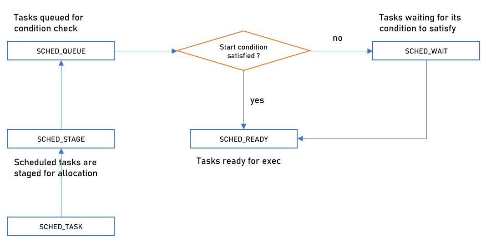

# Allocator Service
- Allocator concurrently performs below tasks periodically for every configured cycle.
..1. `staging` - Stages the tasks that are scheduled on that current time to `SCHED_STAGE`.
..2. `queuing` - Pushes the staged tasks to a queue `SCHED_QUEUE` for start condition check.
..3. `splitting` - Checks the start condition of task and move it to `SCHED_READY` if satisfied or to `SCHED_WAIT`
- Tasks in `SCHED_READY` will be picked by `worker` service then will be executed.
- Tasks in `SCHED_WAIT` will be moved to `SCHED_QUEUE` by `event server` for condition check, when one of tasks in start condition had finished its run.
- Finally task will be unstaged from `SCHED_STAGE` when run is completed.

## Workflow
